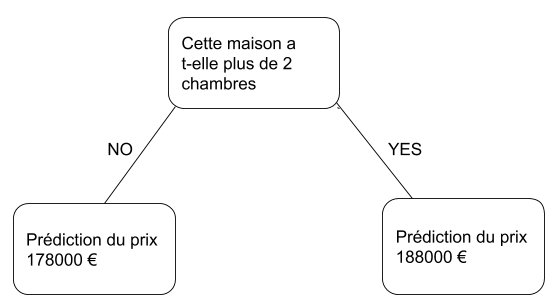

# Introduction

Nous allons commencer par un aperçu du fonctionnement des modèles d’apprentissage automatique et de leur utilisation. Cela peut paraitre simple si vous avez déjà effectué une modélisation statistique ou un apprentissage automatique. Ne vous inquiétez pas, nous allons bientôt construire des modèles puissants.

Ce micro-cours vous permettra de construire des modèles tout au long du scénario suivant:

Votre cousin a fait des millions d'euros en spéculant sur l'immobilier. Il vous a proposé de devenir des partenaires commerciaux en raison de votre intérêt pour la science des données. Il fournira l'argent, et vous fournirez des modèles qui prédisent la valeur de différentes maisons.

Vous lui demandez comment il a prédit les valeurs immobilières dans le passé. Il repond que ce n'est que de l'intuition. En lui questionnant d'avantage sur le sujet, il avoue qu'il utilise des modèles de prix de maisons qu’il a vus dans le passé afin établir des prédictions pour les nouvelles maisons qu’il envisage.

L'apprentissage automatique fonctionne de la même manière. Nous allons commencer avec un modèle appelé l'arbre de décision (decision tree). Il existe des modèles plus sophistiqués qui donnent des prévisions plus précises. Mais les arbres de décision sont faciles à comprendre et constituent la pierre angulaire de certains des meilleurs modèles en science des données.

Pour commencer, nous allons voir l’arbre de décision le plus simple possible.

Cet arbre de décision divise les maisons en deux catégories seulement. Le prix prévu pour toute maison considérée est le prix moyen historique des maisons de la même catégorie.

Nous utilisons des données pour décider de la division des maisons en deux groupes, puis à nouveau pour déterminer le prix prévu dans chaque groupe. Cette étape de capture de modèles à partir de données est appelée adaptation ou apprentissage du modèle. Les données utilisées pour adapter le modèle s'appellent les données d'apprentissage.

Les détails de l'ajustement du modèle (par exemple, comment fractionner les données) sont suffisamment complexes. Ce sera donc abordé plus tard dan le cours. Une fois le modèle ajusté, vous pouvez l'appliquer à de nouvelles données pour prévoir les prix de logements supplémentaires.

Lequel des deux arbres de décision suivants est le plus susceptible de résulter de l'ajustement des données de formation en immobilier?

L'arbre de décision à gauche (Arbre de décision 1) a probablement plus de sens, car il rend compte du fait que les maisons avec plus de chambres à coucher ont tendance à se vendre à des prix plus élevés que les maisons avec moins de chambres. L'inconvénient majeur de ce modèle est qu'il ne prend pas en compte la plupart des facteurs affectant le prix de la maison, tels que le nombre de salles de bain, la taille des terrains, l'emplacement, etc.

Vous pouvez capturer plus de facteurs en utilisant un arbre qui a plus de "divisions". Celles-ci sont appelées arbres "plus profonds". Un arbre de décision prenant également en compte la taille totale du lot de chaque maison pourrait se présenter comme suit:
